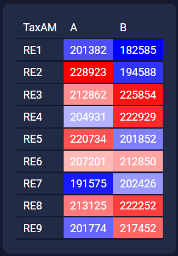
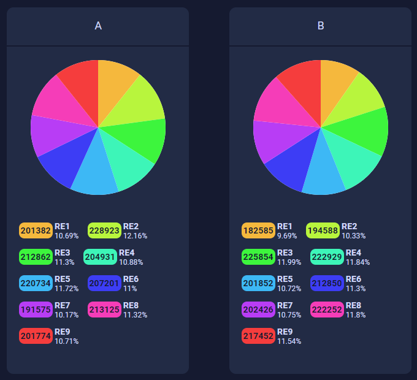
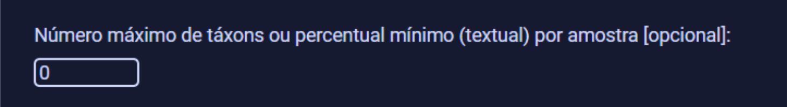
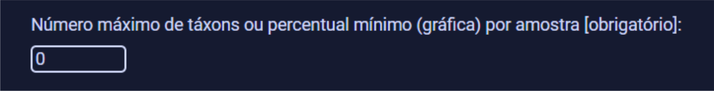

# TaxAM Viewer

- [en](../../readme.md)

TaxAM Viewer é um módulo do projeto [TaxAM](https://github.com/TaxAM/taxam) criado para visualizar de maneira gráfica as matrizes geradas pelo TaxAM.

### Exemplo de uso:
- Matriz TaxAM de entrada:

    ```
    TaxAM	A	B
    RE1	201382	182585
    RE2	228923	194588
    RE3	212862	225854
    RE4	204931	222929
    RE5	220734	201852
    RE6	207201	212850
    RE7	191575	202426
    RE8	213125	222252
    RE9	201774	217452
    ```
- Visualização gráfica em tabela:

    

- Visualização gráfica em pizza:

    

### Como utilizar:
Para selecionar o arquivo TaxAM que será utilizado no programa, clique no botão `Escolher arquivo`.


Em seguida escolha se você quer visualizar os dados como tabela, gráfico de pizza ou ambos.


Se o campo “Número máximo de táxons ou percentual mínimo (textual)” for preechido com
um número inteiro X, o programa irá mostrar, no máximo, os top X táxons de cada amostra (ou
seja, os táxons com maiores valores). Se for preenchido com um número fracionado Y (entre 0 e 1), o programa irá mostrar de cada amostra somente os táxons cuja quantidade/proporção seja maior ou igual ao percentual Y.



Se o campo “Número máximo de táxons ou percentual mínimo (gráfica)” for preechido com
um número inteiro X, o programa irá mostrar, no máximo, os top X táxons de cada amostra (ou
seja, os táxons com maiores valores) e os táxons que estiverem abaixo dessa linha de corte, aparecerão juntos em uma fatia chamada "others". Se for preenchido com um número fracionado Y (entre 0 e 1), o programa irá mostrar de cada amostra somente os táxons cuja quantidade/proporção seja maior ou igual ao percentual Y, e os táxons que estiverem abaixo dessa linha de corte, aparecerão juntos em uma fatia chamada "others".


Para gerar as visualizações, clique no botão "Visualizar".
    


