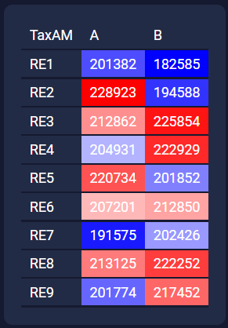
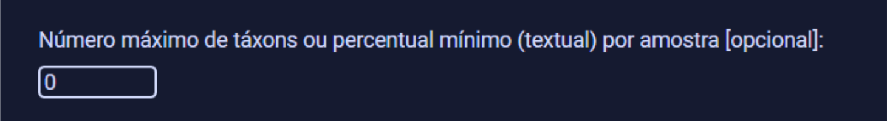
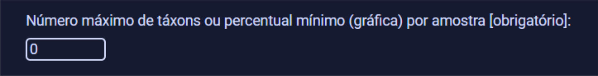

# TaxAM Viewer

 - [pt-br](doc/docs/readme-pt_br.md)

TaxAM Viewer is a module of the project [TaxAM](https://github.com/TaxAM/taxam) created to visualize the matrices generated by TaxAM.

### Use example:
- Input TaxAM matrix:

    ```
    TaxAM	A	B
    RE1	201382	182585
    RE2	228923	194588
    RE3	212862	225854
    RE4	204931	222929
    RE5	220734	201852
    RE6	207201	212850
    RE7	191575	202426
    RE8	213125	222252
    RE9	201774	217452
    ```
- Table visualization in table:

    


- Table visualization in pie:

    

### How to use:
To select the TaxAM file to use in the program, click the `Escolher arquivo` button.


Then, choose the type of visualization you want to generate, tabela(table), gráfico(pie) or ambos(both).


If the field “Número máximo de táxons ou percentual mínimo (textual)” is filled with an integer X, the program will show, at most, the top X taxa of each sample (i.e., the taxa with the highest values). If it is filled with a fraction Y (between 0 and 1), the program will show from each sample only the taxa whose quantity/proportion is greater or equal to the percentage Y.



If the field “Número máximo de táxons ou percentual mínimo (gráfica)” is filled with an integer X, the program will show, at most, the top X taxa of each sample (i.e., the taxa with the highest values) and the taxa that are below this line will be shown together in a slice called "others". If it is filled with a fraction Y (between 0 and 1), the program will show from each sample only the taxa whose quantity/proportion is greater or equal to the percentage Y, and the taxa that are below this line will be shown together in a slice called "others".



To generate the visualization, click the "Visualizar" button.
    


